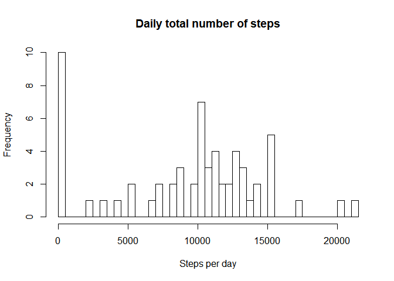
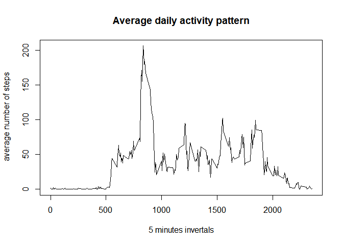
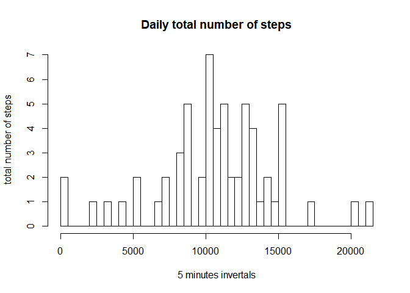
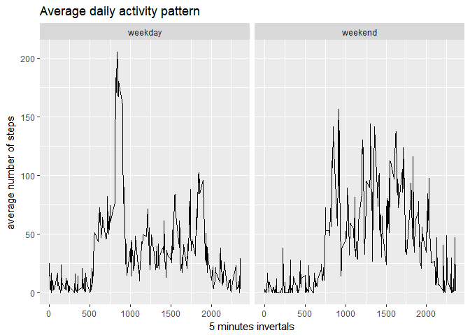

# Reproducible Research: Peer Assessment 1


## Loading and preprocessing the data


```r
unzip("activity.zip") 
data<-read.csv("activity.csv")
data$steps<-as.numeric(data$steps)
data$interval<-as.numeric(data$interval)
```


## What is mean total number of steps taken per day?

######Calculating the total number of steps taken each day and plotting histogram


```r
steps_day<-aggregate(data$steps, by=list(data$date), FUN=sum,na.rm=TRUE)
names(steps_day)<-c("date","steps")
 hist(steps_day$steps,breaks=50,xlab="Steps per day",main="Daily total number of steps")
```

<!-- -->


######Calculate and report the mean and median number of steps taken each day


```r
mean<-mean(steps_day$steps,na.rm=TRUE)
median<-median(steps_day$steps,na.rm=TRUE)
mean_median<-data.frame(mean,median)
mean_median
```

```
##      mean median
## 1 9354.23  10395
```

## What is the average daily activity pattern?

######Time series plot of the average number of steps taken at average 5-minute interval 


```r
steps_avg_day<-aggregate(data$steps, by=list(data$interval), FUN=mean,na.rm=TRUE)
names(steps_avg_day)<-c("interval","steps")
library(ggplot2)
plot(steps_avg_day$interval,steps_avg_day$steps,type="l",xlab="5 minutes invertals", ylab=" average number of steps",main="Average daily activity pattern")
```

<!-- -->

######Which 5-minute interval, on average across all the days in the dataset, contains the maximum number of steps?


```r
steps_avg_day[with(steps_avg_day,order(-steps)),][1,1]
```

```
## [1] 835
```

## Imputing missing values

######Calculate and report the total number of missing values

```r
sum(is.na(data))
```

```
## [1] 2304
```

######Strategy for filling all missing values 


```r
random.imp<-function(x){
        missing<-is.na(x)
        n.missing<-sum(missing)
        x.obs<-x[!missing]
        imputed<-x
        imputed[missing]<-sample(x.obs,n.missing, replace=TRUE)
        return(imputed) 
        }
impsteps<-random.imp(data$steps)
```

######Create new dataset that is equal to the original dataset but with the missing data filled in


```r
data$imputed_steps<-paste(random.imp(data$steps))
data$imputed_steps<-as.numeric(data$imputed_steps)
```

######Histogram of the total number of steps taken each day after missing values are imputed, and report the mean and median total number of steps taken per day. 


```r
steps_imp_day<-aggregate(data$imputed_steps, by=list(data$date), FUN=sum)
names(steps_imp_day)<-c("date","steps")
hist(steps_imp_day$steps, breaks=50, xlab="5 minutes invertals", ylab=" total number of steps",main="Daily total number of steps")
```

<!-- -->

```r
mean_imp<-mean(steps_imp_day$steps,na.rm=TRUE)
median_imp<-median(steps_imp_day$steps,na.rm=TRUE)
mean_median_imp<-data.frame(mean_imp,median_imp)
mean_median_imp
```

```
##   mean_imp median_imp
## 1 10813.66      10970
```

These values are a little bit different from the first part of the assignment. Imputing missing data may introduce bias to the dataset, if there are too many missing values it could affect the overal data value. 


## Are there differences in activity patterns between weekdays and weekends?

#####Panel plot comparing the average number of steps taken per 5-minute interval across weekdays and weekends

#####Create new factor variable in the dataset with two levels "weekday" and "weekend" 

```r
library(lubridate)
```

```
## Warning: package 'lubridate' was built under R version 3.4.2
```

```
## 
## Attaching package: 'lubridate'
```

```
## The following object is masked from 'package:base':
## 
##     date
```

```r
data$date<-as.Date(data$date)
weekday<-c("Mon","Tues","Wed","Thurs","Fri")
data$wDay<-factor((wday(data$date,label=TRUE) %in% weekday), levels=c(TRUE,FALSE), labels=c("weekday","weekend")) 
```

#####Make panel plot containing a time series plot and the average number of steps taken, averaged across all weekday days or weekend days (y-axis). 

```r
steps_avg<-aggregate(data$imputed_steps, by=list(data$interval,data$wDay), FUN=mean, na.rm=TRUE)
names(steps_avg)<-c("interval","wDay","steps")
ggplot(steps_avg, aes(x=interval,y=steps))+geom_line()+facet_grid(.~wDay)+labs(title="Average daily activity pattern",x="5 minutes invertals",y="average number of steps")
```

<!-- -->


